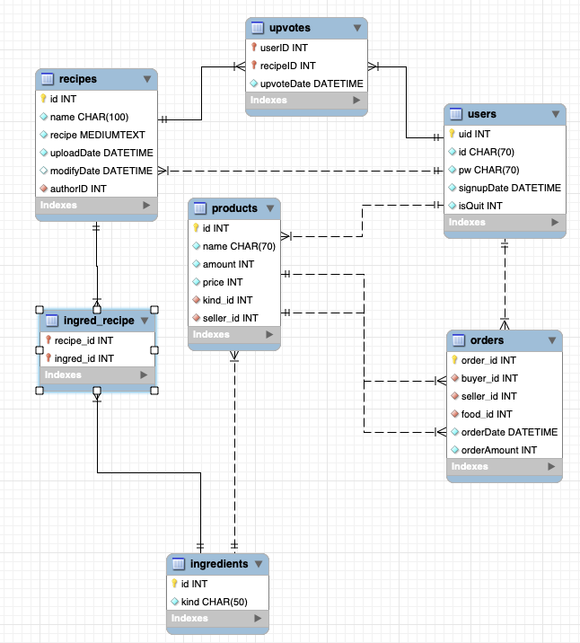

# Express Recipe

## About this project

Sharing recipes and purchasing ingredients website implemented by Vue.js, Node.js, MariaDB. 

**Only need Docker to initialize and run.**

### Built With

### DB structures.

## Getting started

### Prerequisites

[Docker][1]

### How to run

1. Fill .env.example in root folder and change its name to '.env'.

1. Use command <code>docker compose up</code> to build image and containers consisting Frontend(Vue.js), Backend(Node.js) and Database(MariaDB) and run them.

1. If you want remove image and containers, use command <code>docker compose down --rmi local</code> in project root folder.

## How to Use (Preview)

If you want to see how to use this website, see [this][2].

## LICENSE

Distributed under the MIT License.

[1]: https://www.docker.com/get-started
[2]: ./examples/readme.md
